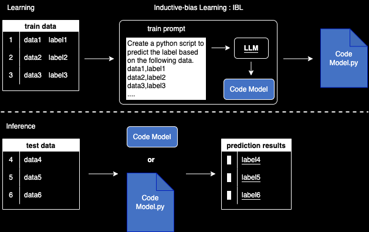

# IBLM:Inductive-bias Learning Models
<div align="center">
[[ArXiv]]()
</div>
※ I am currently writing a paper. Please contact ulti4929@gmail.com if you are interested.

- [What is IBL](#what-is-ibl)
- [How to Use](#how-to-use)
    - [Setting](#setting)
    - [Binary classificatin](#binary-classification)
    - [Notebooks](#notebooks)
- [Supported Models](#supported-models)
- [Contributor](#contributor)
- [Backstory](#backstory)


## What is IBL?
IBL (Inductive-bias Learning) is a new machine learning modeling method that uses LLM to infer the structure of the model itself from the data set and outputs it as Python code. The learned model (code model) can be used as a machine learning model to predict a new dataset.In this repository, you can try different learning methods with IBL.(Currently only binary classification with simple methods is available.)




## How to Use

### Setting

* Installation
```python
pip install iblm
```
* OpenAI API key settings
```python
os.environ["OPENAI_API_KEY"] = "OPENAI_API_KEY"
```

### Binary classification
Currently, only small amounts of data can be executed.
* Model Definition
```python
from iblm import IBLModel

# Load LLM via LangChain. (GPT-4 recommended)
llm_model = OpenAI(temperature=0, model_name = 'gpt-4-0613')

params = {
    'columns_name': True,
    'objective': 'classification',
    }

iblm = IBLModel(llm_model = llm_model, params=params)
```

* Model Learning
```python
model = iblm.fit(x_train, y_train)
```

* Model Predictions
```python
y_proba = iblm.predict(x_test)
```

### Notebooks
Use the link below to try it out immediately on Google colab.
- Binary classification:[](https://colab.research.google.com/github/fuyu-quant/IBLM/blob/main/examples/iblmodel/iblmodel_titanic.ipynb)


## Supported Models
Currently, the recommended model is GPT-4


## Contributor
- [@t-ymbys](https://github.com/t-ymbys)
- [@cn47](https://github.com/cn47)


## Backstory
This idea is based on [langchain-tools](https://github.com/fuyu-quant/langchain-tools), which was created in an attempt to make LLM learn LightGBM.